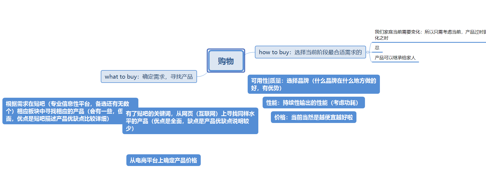

onedrive教育版（用学生邮箱即可激活）

###### 买卖教训 ######

- 买东西之前先问价格
- 货比三家，买东西先看平均市场价，如果不了解就买，并且买的很急很容易就上当受骗

- 别人画大饼，不用太过于急切，买卖得细水长流，有东西不怕卖 

- 有钱别一次性交出去(给卖家)，可以用钱吊着

- 尽可能的掌握多的信息。

  尤其在网络交易时代，有更多的卖方信息更为有利（真实的身份信息或者是qq号）

###### 电商平台相关 ######

- 衣服吊牌缺失或经过洗涤后不支持7天无理由

- 买东西快递速度，发货时间，运费险，等额外服务的比较
- 买东西之后的质保和换新不要忽略

- 买完东西之后不久降价可以保价

- 电商平台买东西有交易快照，可以找到当时的货物信息
- 网上的东西不一定便宜，合适（衣服），有时实体店更好

- 快递可以拒收，京东拒收很方便，淘宝可能要商量下。

- 收货时尽量保留包装，方便有损坏时退货

- 退货之前要拍照

